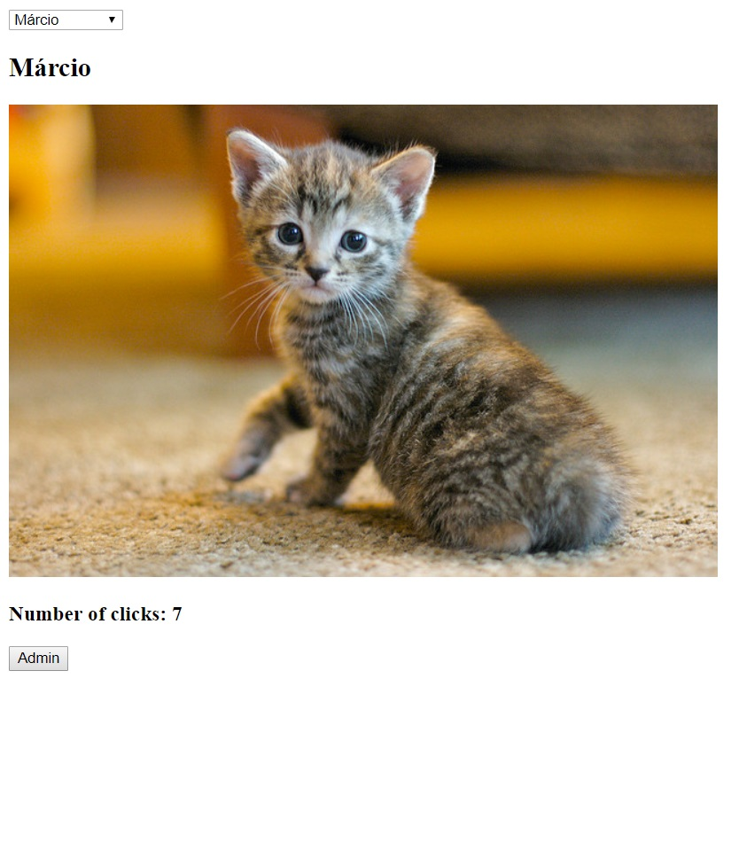
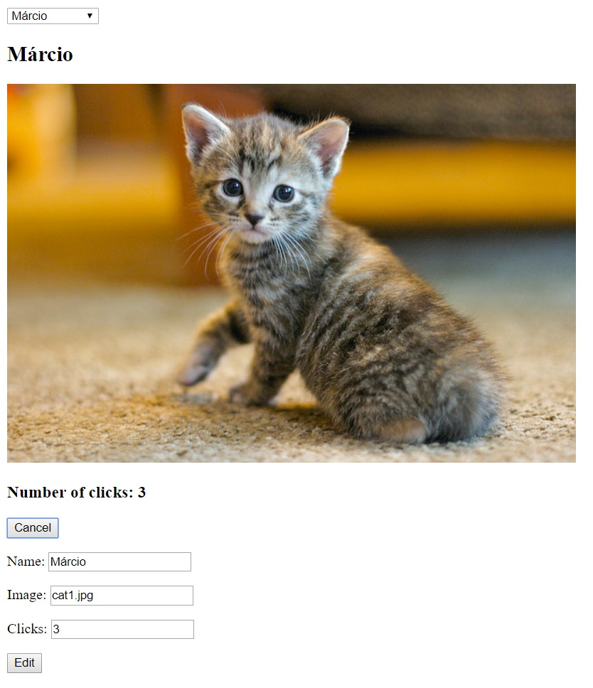

# Cat Clicker

Just an experiment app with JQuery to make some DOM manipulation.

The app uses MVVM pattern (aka, MVO - "Model View Octopus", lol) and it was based in some exercises from [Udacity Full Stack Web Developer Nanodegree](https://www.udacity.com/course/full-stack-web-developer-nanodegree--nd004).

It's a simple app where users can manipulate an existing cat dataset and change some attributes as name, picture* and clicks. There's no data persistence.

By directly clicking in a cat picture, it also increments its click count.

_*Pictures are restricted to available local images (cat1.jpg, cat2.jpg,..., cat5.jpg) or any URL image._

**Images:**

<table align="center">
  <tr>
     <td>
       
       
Main View

     </td>
     <td>
       
       
Admin View

     </td>
  </tr>
</table>
